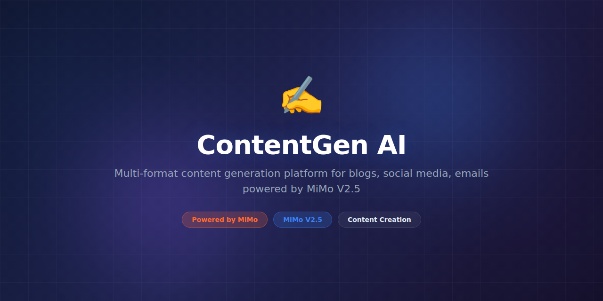

# ContentGen AI



> **Powered by MiMo** — built on top of Xiaomi's [MiMo](https://platform.xiaomimimo.com) reasoning models for high-quality content generation and editing.

[](https://opensource.org/licenses/MIT)
[](https://platform.xiaomimimo.com)
[](https://www.python.org/downloads/)

---

## Why MiMo

Content generation with AI is ubiquitous, but quality varies wildly. Most AI-written content is generic, structurally repetitive, and lacks the reasoning depth needed for technical or nuanced topics. The difference between mediocre and excellent AI content comes down to the model's ability to reason about structure, audience, purpose, and the logical flow of arguments.

MiMo V2.5 brings genuine reasoning to the writing process. It can plan document structure before writing a single word, maintain consistent voice across sections, build logical arguments with proper evidence, and adapt complexity to the target audience. For technical content especially — documentation, blog posts, tutorials — this reasoning ability produces output that reads like it was written by someone who actually understands the topic, not just someone who can rearrange training data.

The model also excels at iterative refinement. Given feedback or editorial guidelines, MiMo can revise content while maintaining coherence, improving specific aspects without degrading others. This nuanced editing capability is what separates MiMo-powered content from generic LLM output — the ability to surgically improve without introducing new problems.

## Token consumption

| Agent | Model | Tokens/run | Frequency | Daily/user |
|---|---|---|---|---|
| Planner | MiMo V2.5 | ~1,800 | Per document | ~18,000 |
| Writer | MiMo V2.5 | ~6,400 | Per document | ~64,000 |
| Editor | MiMo V2.5 | ~3,200 | Per revision | ~32,000 |
| **Total** | | **~11,400** | | **~114,000** |

> Estimates assume 10 documents/day with 2 revision rounds each. Blog posts consume fewer tokens; long-form technical docs consume more.

## What it does

ContentGen AI generates blog posts, technical documentation, tutorials, marketing copy, and social media content with MiMo-powered reasoning ensuring structural coherence, factual accuracy, and audience-appropriate tone. It supports iterative editing with voice consistency and multi-format export.

## Why this exists

Content teams spend 60% of their time on first drafts and restructuring rather than on creative strategy and distribution. Existing AI writing tools produce generic content that requires heavy editing — sometimes more time than writing from scratch. ContentGen AI produces reasoning-driven first drafts that are publication-ready, freeing teams to focus on strategy, polish, and distribution.

## Features

- Multi-format content generation (blog, docs, tutorials, copy, social, email)
- Audience-aware tone and complexity adjustment (beginner to expert)
- Document structure planning with outline-first generation
- Iterative editing with voice consistency preservation
- SEO optimization with keyword integration and meta generation
- Style guide enforcement from custom YAML configuration
- Bulk generation mode for content calendars
- Export to Markdown, HTML, DOCX, and CMS-ready formats
- Content scoring (readability, SEO, engagement predictions)
- Brand voice learning from existing content samples

## Tech Stack

- **Runtime:** Python 3.11+
- **AI Engine:** MiMo V2.5 via Xiaomi Platform API
- **CLI:** Click with rich terminal output
- **Storage:** SQLite (project cache), local filesystem
- **Export:** python-docx, Jinja2 (HTML), Markdown, frontmatter
- **SEO:** custom keyword analysis module with search volume data
- **Analytics:** readability scoring (Flesch-Kincaid), word count tracking
- **Infra:** Docker, pip

## Quickstart

```bash
# Clone and install
git clone https://github.com/your-org/ContentGen-AI.git
cd ContentGen-AI
pip install -e ".[dev]"

# Configure
cp .env.example .env
# Set MIMO_API_KEY in .env

# Generate a blog post
python -m contentgen write \
  --topic "Building production APIs with FastAPI" \
  --format blog \
  --audience intermediate \
  --output post.md

# Generate with SEO optimization
python -m contentgen write \
  --topic "Python async patterns" \
  --format blog \
  --keywords "asyncio,python,concurrency" \
  --output seo-post.md

# Edit existing content
python -m contentgen edit post.md \
  --instruction "Make the intro more engaging and add code examples"

# Bulk generate from a content calendar
python -m contentgen batch content-calendar.yaml

# Score existing content
python -m contentgen score post.md
```

## Project Structure

```
ContentGen-AI/
├── assets/
│   └── banner.png
├── contentgen/
│   ├── __init__.py
│   ├── cli.py              # Click CLI entry point
│   ├── planner.py          # MiMo content planning & outlining
│   ├── writer.py           # MiMo content generation
│   ├── editor.py           # MiMo editing & refinement
│   ├── formats.py          # Format-specific templates & rules
│   ├── seo.py              # SEO keyword analysis & optimization
│   ├── styles.py           # Style guide enforcement
│   ├── scorer.py           # Content quality scoring
│   ├── voice.py            # Brand voice learning
│   └── export.py           # Multi-format export (MD, HTML, DOCX)
├── templates/              # Content format templates
│   ├── blog.yaml
│   ├── tutorial.yaml
│   └── documentation.yaml
├── tests/
│   ├── test_writer.py
│   ├── test_editor.py
│   └── fixtures/
├── .env.example
├── Dockerfile
├── pyproject.toml
└── README.md
```

## Contributing

See [CONTRIBUTING.md](CONTRIBUTING.md) for guidelines. We welcome new content format templates, style guide integrations, and export format support.

## Configuration

Define style guides and content templates:

```yaml
# style-guide.yaml
brand:
  name: "Acme Tech"
  voice: "professional but approachable"
  forbidden_words: ["synergy", "leverage", "disrupt"]

seo:
  target_keyword_density: 1.5
  min_word_count: 1200
  meta_description_length: 155

templates:
  blog:
    sections: ["intro", "problem", "solution", "example", "conclusion"]
    code_blocks: true
    min_images: 1
  tutorial:
    sections: ["prerequisites", "setup", "walkthrough", "troubleshooting"]
    code_blocks: required
    difficulty: auto
```

## License

MIT License — see [LICENSE](LICENSE) for details.

---

*Built with ❤️ using MiMo reasoning models.*
